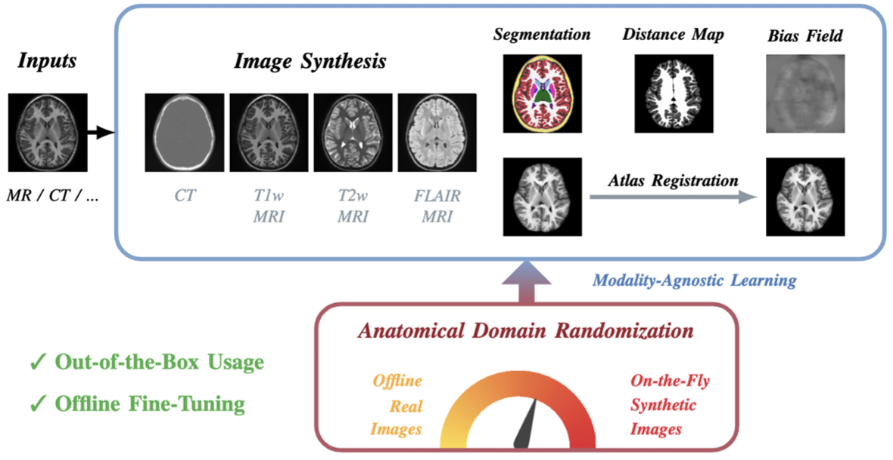

## <p align="center">[A Modality-agnostic Multi-task Foundation Model for Human Brain Imaging](https://arxiv.org/abs/2509.00549)</p>

**<p align="center">Peirong Liu<sup>1,2</sup>, Oula Puonti<sup>2</sup>, Xiaoling Hu<sup>2</sup>, Karthik Gopinath<sup>2</sup>, Annabel Sorby-Adams<sup>2</sup>, Daniel C. Alexander<sup>3</sup>, Juan Eugenio Iglesias<sup>2,3,4</sup></p>**

 
<p align="center">
<sup>1</sup>Johns Hopkins University<br />
<sup>2</sup>Harvard Medical School and Massachusetts General Hospital<br />
<sup>3</sup>University College London <br />
<sup>4</sup>Massachusetts Institute of Technology
</p>

<p align="center">
  
</p>


This is the official repository for our preprint: A Modality-agnostic Multi-task Foundation Model for Human Brain Imaging [[arXiv]](https://arxiv.org/abs/2509.00549)<br />
More detailed and organized instructions are coming soon...

## Environment
Training and evaluation environment: Python 3.11.4, PyTorch 2.0.1, CUDA 12.2. Run the following command to install required packages.
```
conda create -n pre python=3.11
conda activate pre

git clone https://github.com/jhuldr/BrainFM
cd /path/to/brainfm
pip install -r requirements.txt 
```


## Generator
```
cd scripts 
python demo_generator.py
```

### Generator setups
Setups are in cfgs/generator, default setups are in default.yaml. A customized setup example can be found in train/brain_id.yaml, where several Brain-ID-specific setups are added. During Config reading/implementation, customized yaml will overwrite default.yaml if they have the same keys.

dataset_setups: information for all datasets, in Generator/constants.py<br>
augmentation_funcs: augmentation functions and steps, in Generator/constants.py<br>
processing_funcs: image processing functions for each modality/task, in Generator/constants.py<br>

dataset_names: dataset name list, paths setups in Generator/constants.py<br>
mix_synth_prob: if the input mode is synthesizing, then probability for blending synth with real images<br>
dataset_option: generator types, could be BaseGen or customized generator<br>
task: switch on/off individual training tasks 

### Base generator module
```
cd Generator
python datasets.py
```
The dataset paths setups are in constants.py. In datasets.py, different datasets been used are fomulated as a list of dataset names.

A customized data generator module example can be found in datasets.py -- BrainIDGen. 


Refer to "__getitem__" function. Specifically, it includes: <br>
(1) read original input: could be either generation labels or real images;<br>
(2) generate augmentation setups and deformation fields; <br>
(3) read target(s) according to the assigned tasks -- here I seperate the processing functions for each item/modality, in case we want different processing steps for them; <br>
(4) augment input sample: either synthesized or real image input.


(Some of the functions are leaved blank for now.)


## Trainer
```
cd scripts 
python train.py
```

## Downloads
The pre-trained model weight is available on [OneDrive](https://livejohnshopkins-my.sharepoint.com/:u:/g/personal/pliu53_jh_edu/EZ_BJ7K6pMJEj9hZ8SA51GYBxH_Nan4fA3a-s4udwvVRog?e=nwZ7JC).


## Citation
```bibtex
@article{Liu_2025_BrainFM,
    author    = {Liu, Peirong and Puonti, Oula and Hu, Xiaoling and Gopinath, Karthik and Sorby-Adams, Annabel and Alexander, Daniel C. and Iglesias, Juan E.},
    title     = {A Modality-agnostic Multi-task Foundation Model for Human Brain Imaging},
    booktitle = {arXiv preprint arXiv:2509.00549},
    year      = {2025},
}
